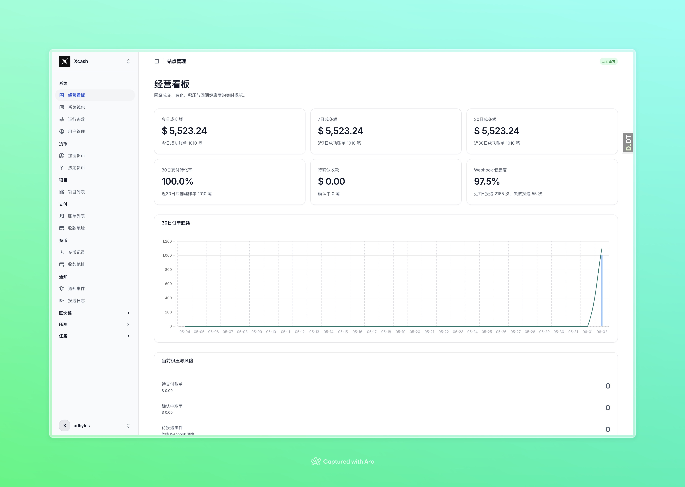
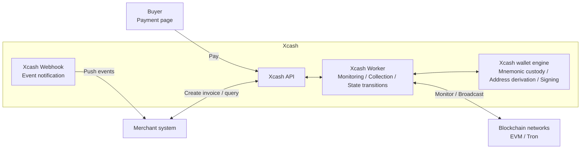

# Xcash

<p align="center">
  <strong>Open-Source Self-Hosted Cryptocurrency Payment Gateway</strong>
  <br />
  Accept USDT, ETH, and assets across major EVM chains and Tron with zero platform fees and full self-custody.
</p>

<p align="center">
  <a href="https://xca.sh"></a>
  <a href="https://github.com/xca-sh/xcash/stargazers"></a>
  <a href="LICENSE"></a>
  
  
</p>

<p align="center">
  English | <a href="README.md">Simplified Chinese</a>
</p>

## What is Xcash?

**Xcash** is an open-source, self-hosted **cryptocurrency payment gateway** for businesses, SaaS products, exchanges, and wallet platforms. It helps you accept crypto payments, USDT payments, and on-chain deposits directly through your own infrastructure.

Unlike hosted payment processors such as CoinGate or OpenNode, Xcash is **fully self-custodial**: payments flow through smart contracts straight to your own wallet addresses, Xcash never takes custody of funds, and it charges no platform fee. It is designed for teams that need multi-chain payment collection, deposits, and webhook notifications.

**Use cases:** e-commerce crypto payments, USDT deposit systems, cross-border stablecoin settlement, SaaS subscription billing in crypto, on-chain collection infrastructure, and internal treasury reconciliation.

## Features

| Feature | Detail |
|---------|--------|
| Invoice payments | Fixed-amount, time-limited invoice collection for checkout, subscription billing, and more |
| Dedicated deposit addresses | Each user gets a dedicated address—transfer in anytime for instant crediting, just like an exchange |
| Self-custody | Payments flow through smart contracts straight to your wallet; Xcash never holds funds |
| Zero platform fees | No percentage cuts, pay only blockchain gas |
| Multi-chain & multi-asset | Major EVM chains plus Tron, with support for any ERC-20 token |
| Multi-merchant & multi-project | Isolated management of multiple merchants and projects on a single instance |
| Contract invoices | EVM chains can derive a dedicated CREATE2 address per invoice |
| On-chain risk control | MistTrack risk scoring on the source addresses of payments and deposits |
| Webhooks | Real-time payment and deposit event notifications |
| EasyPay compatibility | Compatible with the EasyPay V1 protocol for smooth migration |
| Docker deployment | One-command production deployment with Docker Compose |

## Payments vs. Deposits

Xcash offers two ways to receive funds—distinguish them before integrating:

- **Payments**: Invoice-based collection. Each transaction creates a fixed-amount, time-limited invoice that completes once the buyer pays—ideal for one-off collection such as e-commerce checkout or subscription billing. Payments come in two modes based on how addresses are assigned:
  - **Differential payments**: Buyers share collection addresses, and invoices are told apart by a tiny amount difference. Works on every chain with no extra deployment cost; but the number of concurrent invoices for the same asset and amount is bounded by the available difference slots, so bursts of identical-amount orders can fail to allocate.
  - **Contract payments**: EVM-only. CREATE2 derives a dedicated collection address per invoice. Addresses never collide, so it handles high concurrency naturally and amounts need no difference offset.
- **Deposits**: Exchange-style top-ups. Each user is assigned a dedicated deposit address and can transfer in anytime for instant crediting, with no invoice required—ideal for wallets and trading platforms that maintain user balances.

## Supported Chains

| Feature | ETH | BNB Chain | Arbitrum | Base | Tron | Polygon | Avalanche | Optimism | Other EVM |
|:-------:|:---:|:---------:|:--------:|:----:|:----:|:-------:|:---------:|:--------:|:---------:|
| Payment | Yes | Yes | Yes | Yes | Yes | Yes | Yes | Yes | Yes |
| Deposit | Yes | Yes | Yes | Yes | No | Yes | Yes | Yes | Yes |

All EVM-compatible chains can be enabled from the admin panel without code changes.

## Token Support

EVM chains support arbitrary ERC-20 tokens. Add the token contract address in the admin panel to enable assets such as USDT, USDC, or custom business tokens.

Tron currently supports payment flows only and is focused on TRC20-USDT collection.

## Risk Control

Xcash includes risk query, caching, persistence, and display capabilities. Address risk detection is provided by external MistTrack services; Xcash does not maintain its own blacklist or custom risk model.

Risk checks currently cover two core fund entry points:

- **Payment invoices:** after an invoice is matched with an on-chain payment, Xcash asynchronously checks the payer address and stores the risk level and risk score.
- **User deposits:** after a deposit record is created, Xcash asynchronously checks the source address and stores the risk level and risk score.

Risk results are stored in dedicated risk assessment records with status, target type, source address, transaction hash, risk level, risk score, reasons, report URL, and error summary. The Django admin, API responses, and webhooks expose risk information so operators and merchant systems can review or react to suspicious funds.

Xcash supports MistTrack OpenAPI V3 first and can fall back to the QuickNode MistTrack add-on when no MistTrack OpenAPI key is configured.

## Why Xcash?

| vs. | Xcash | CoinGate | OpenNode |
|---|---|---|---|
| Self-hosted | Yes | No | No |
| Major EVM chains and Tron | Yes | Yes | No |
| Zero platform fees | Yes | No | No |
| On-chain deposits | Yes | No | No |
| Risk control | Yes | No | No |
| EasyPay compatibility | Yes | No | No |
| Docker deployment | Yes | N/A | N/A |

## Screenshots



## Architecture



## Deployment Requirements

Before deploying Xcash, prepare the following:

- Linux server, recommended Ubuntu 22.04+ or Debian 12+
- Docker and Docker Compose
- A domain name pointing to the server
- RPC endpoints for the chains you want to enable
- A TronGrid API key if you want to enable Tron payments

Recommended server profiles:

| Performance mode | Hardware | Payment only | Native coin scanning enabled |
|:----------------:|:--------:|:------------:|:----------------------------:|
| low | 1 CPU / 2 GB RAM | 5 - 10 EVM chains | 2 - 3 EVM chains |
| medium | 4 CPU / 8 GB RAM | 15 - 30 EVM chains | 8 - 15 EVM chains |
| high | 8 CPU / 16 GB RAM | 30+ EVM chains | 15 - 30 EVM chains |

Set `PERFORMANCE` in `.env` to `low`, `medium`, or `high`. If it is not set, Xcash uses `low`.

Native EVM coin scanning is disabled by default. Deposit collection and chain confirmation depend on native coin scanning and continuous block polling. Enable it in the admin panel under **System -> Platform parameters** only when your RPC provider can handle high-frequency calls.

## Quick Start

### 1. Clone the repository

```bash
git clone https://github.com/xca-sh/xcash.git
cd xcash
```

### 2. Initialize environment variables

```bash
make init-env
```

This generates two env files with auto-filled random secrets:

- `.env` — shared by the main app containers (django/worker/beat), docker compose interpolation, and local dev. Holds the Django secret key, main DB password, and the wallet mnemonic encryption key (`WALLET_MNEMONIC_ENCRYPTION_KEY`), etc.

> ⚠️ Do **not** modify `WALLET_MNEMONIC_ENCRYPTION_KEY` after it is generated. Address derivation and transaction signing run inside the main system, and wallet mnemonics are stored encrypted with AES-256-GCM using this key. Changing it makes every encrypted mnemonic in the database permanently undecryptable and loses the hot-wallet private keys. Back up `.env` offline and never commit it.

### 3. Configure your domain

Edit `.env` and set `SITE_DOMAIN`:

```env
SITE_DOMAIN=xcash.example.com
```

Point the domain to your server and configure a reverse proxy such as Nginx or Caddy to forward traffic to `http://localhost:6688`.

### 4. Start services

```bash
make up
```

On first startup, if no admin account exists, Xcash creates the default admin account:

```text
username: admin
password: Admin@123456
```

Change the default password immediately after first login. OTP setup is required during the first admin login flow.

### 5. Stop services

```bash
make down
```

This stops and removes the production Docker Compose service containers without deleting database volumes.

### 6. Configure chain RPC endpoints

Open the admin panel and go to **Chain management**. Fill in RPC endpoints for the chains you want to use.

Recommended RPC providers include [QuickNode](https://www.quicknode.com/), [Alchemy](https://www.alchemy.com/), and [Infura](https://www.infura.io/). Tron payments require a [TronGrid](https://www.trongrid.io/) API key.

### 7. Upgrade to the latest version

```bash
make upgrade
```

This pulls the latest `main` branch and runs the full production upgrade flow.

## API Integration

After deployment, see [API.md](API.md) to integrate payments, deposits, and webhook callbacks.

Invoice creation can include an invoice-level `notify_url` to override the project default webhook. The EasyPay V1-compatible `submit.php` endpoint also maps `notify_url` to the invoice-level notification URL.

## Tech Stack

- **Backend:** Django 5.2 + Django REST Framework
- **Queue:** Celery + Redis
- **Database:** PostgreSQL
- **Blockchain:** web3.py for EVM
- **Wallet derivation:** BIP44 HD wallets with bip-utils
- **Payment frontend:** React 19 + Vite + Tailwind CSS
- **Deployment:** Docker Compose

## Roadmap

- [ ] Solana support
- [x] Tron support
- [ ] Documentation website

## Cloud Service

If you do not want to deploy and maintain Xcash yourself, you can use the hosted version:

**[xca.sh](https://xca.sh)** - ready to use, no self-hosting required, continuously updated.

## Commercial Support

For deployment, integration, or operational support, contact:

tech@xca.sh

## Contributing

Issues and pull requests are welcome.

## License

[MIT](LICENSE)
