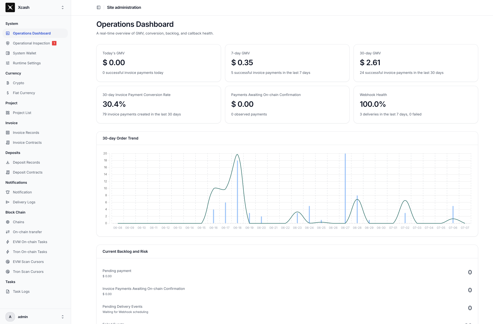
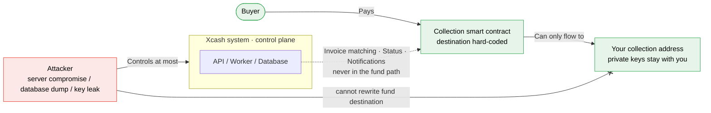
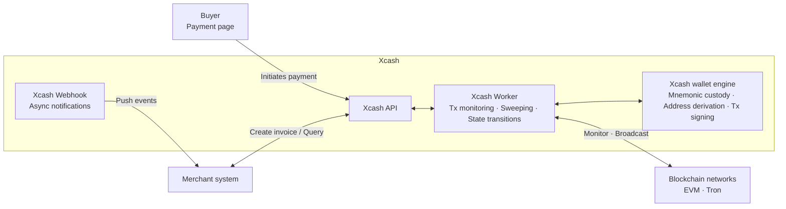

<div align="center">

# Xcash

**Self-hosted, non-custodial crypto payment gateway**

Accept USDT, USDC, ETH and any ERC-20 across major EVM chains — plus USDT on Tron.
Funds move through smart contracts straight into your own wallet:
**zero platform fees, no KYC, no one standing between you and your money.**

<p>
  <a href="https://xca.sh"></a>
  <a href="https://xca.sh/docs/"></a>
  <a href="https://github.com/xca-sh/xcash/stargazers"></a>
  <a href="LICENSE"></a>
  
  
</p>

<p>
  <a href="#quick-start">Quick Start</a> ·
  <a href="https://xca.sh/docs/">Documentation</a> ·
  <a href="API.md">API Reference</a> ·
  <a href="README.zh-CN.md">简体中文</a>
</p>

</div>



## Why Xcash?

Hosted crypto payment processors stand between you and your money: they take custody of funds until payout, charge a percentage of every transaction, require KYC, and can freeze your account — or shut down entirely. Xcash takes the opposite approach: the gateway runs on your server, and the money never stops being yours.

- **Non-custodial by design** — collections flow through minimal smart contracts whose destination is hard-coded to your own collection address. Xcash handles invoice matching, confirmations and notifications; it is never in the fund path.
- **Zero platform fees** — no percentage cut when you self-host. You only pay on-chain gas, and batched sweeping keeps the cost of a sweep close to a plain token transfer.
- **Stablecoin-first, multi-chain** — any ERC-20 on Ethereum, BNB Chain, Arbitrum, Base, Polygon, Optimism and other EVM chains; USDT and native TRX on Tron.
- **Two collection modes in one system** — invoice payments for checkout and subscriptions, plus exchange-style dedicated deposit addresses for platforms that maintain user balances.
- **Production-ready out of the box** — multi-merchant / multi-project isolation, MistTrack risk scoring, reliable webhooks, EasyPay V1 compatibility, one-command Docker deployment.

### How it compares

|  | **Xcash** (self-hosted) | Hosted processors¹ | BTCPay Server |
|---|:---:|:---:|:---:|
| Custody of funds | Non-custodial — straight to your wallet | Processor holds funds until payout | Non-custodial |
| Platform fee | **0** | typically 0.4%–1% per transaction | 0 |
| KYC / account approval | None | usually required | None |
| Stablecoins on EVM + Tron | Any ERC-20, plus Tron USDT | varies by provider | Bitcoin-first; altcoins via plugins |
| Exchange-style deposit addresses | Built-in | rare | — |
| EasyPay (易支付) V1 protocol | Compatible | — | — |

¹ e.g. CoinPayments, NOWPayments, CoinGate.

## Quick Start

Get a production gateway running in minutes. You need a Linux server with Docker and a domain pointed at it:

```bash
git clone https://github.com/xca-sh/xcash.git
cd xcash
./scripts/init_env.sh    # generates .env with random secrets
# edit .env and set SITE_DOMAIN=pay.example.com
docker compose up -d
```

The bundled Caddy listens on `127.0.0.1:6688`; point your reverse proxy (Nginx, Caddy, …) at it for TLS. First startup creates a default admin account — `admin` / `Admin@123456` — **change the password immediately**. Then, in the admin panel:

1. Fill in RPC endpoints for the chains you want to enable (QuickNode / Alchemy / Infura; TronGrid API key for Tron).
2. Fund the system wallet with a small amount of gas on each enabled chain.
3. Create a project, set its collection address, and integrate through the [REST API](API.md).

The [deployment guide](#deployment-guide) below covers every step in detail; full docs live at [xca.sh/docs](https://xca.sh/docs/).

> Don't want to run servers? **[xca.sh](https://xca.sh)** is the official hosted cloud — the first $500 of monthly volume is fee-free.

## Security: why a compromised server can't steal your funds

Suppose the server running Xcash is fully compromised — database dumped, secrets leaked. As long as your collection address is intact, your assets are not at risk: payments made before, during and after the incident still land in your wallet, because there is nothing on the server that could redirect them.

Security is a structural property of Xcash, not a feature bolted on:

- **Xcash never takes custody of your collections.** Funds do not pass through any account the system controls on your behalf.
- **Contract collections hard-code the destination.** The collection smart contracts can only ever forward funds to your collection address — the attacker cannot rewrite that.
- **The collection contract is intentionally minimal.** One job, near-zero attack surface.



The fund path (green) is fixed by the smart contract and only ever flows *buyer → collection contract → your collection address*. Xcash itself is a control plane — invoice matching, state transitions, notifications — and **is not in the fund path**. Even an attacker with full control of the Xcash system sees invoice data at most; they cannot change where the money goes.

## Two ways to get paid

Xcash provides two collection modes. Decide which one fits your business before integrating:

- **Invoice payments** — each transaction creates a fixed-amount, time-limited invoice that completes when the buyer pays. Supports both direct-to-wallet collection and smart-contract collection, where every invoice gets an independent contract address — no address collisions, no amount fudging, high concurrency by default. Ideal for e-commerce checkout and subscription billing.
- **Deposits** — every user gets a dedicated deposit address, shared across chains and monitored in real time. Users transfer in whenever they like and are credited after block confirmation, with no order to create — the same UX as an exchange. Ideal for wallets, trading platforms, and any business that maintains user balances.

## Features

| Feature | Detail |
|---------|--------|
| Invoice payments | Fixed-amount, time-limited invoices for checkout, subscriptions and one-off charges |
| Deposits | Dedicated per-user deposit addresses credited on confirmation — exchange-style UX |
| Non-custodial | Collections flow through smart contracts straight to your wallet; Xcash never holds funds |
| Zero platform fees | No transaction percentage when self-hosting; only small on-chain gas costs |
| Multi-chain, multi-asset | Major EVM chains with any ERC-20 token; USDT and TRX on Tron |
| Multi-merchant, multi-project | Isolated merchants and projects on a single instance, each with its own auth keys and collection address |
| Contract invoices | Independent contract address per invoice, swept automatically after confirmation |
| On-chain risk screening | MistTrack risk scores for payer and deposit source addresses, exposed via API and webhooks |
| Webhook callbacks | Real-time payment and deposit events, automatic retries, nonce-based idempotency |
| EasyPay compatibility | Standard EasyPay (易支付) V1 protocol for painless migration from legacy systems |
| Docker deployment | One-command production deployment with Docker Compose |

## Chain support

| Feature | ETH | BNB Chain | Arbitrum | Base | Tron | Polygon | Optimism |
|:--:|:---:|:---------:|:--------:|:----:|:----:|:-------:|:--------:|
| Payments | Yes | Yes | Yes | Yes | Yes | Yes | Yes |
| Deposits | Yes | Yes | Yes | Yes | Yes | Yes | Yes |

Additional EVM chains can be enabled by filling in an RPC endpoint in the admin panel.

## Token support

| Chain type | Native assets | Token standard | Current scope | How to enable |
|:------:|:--------:|:--------:|:------------|:---------|
| EVM | ETH, BNB, POL, etc. (used for gas) | ERC-20 | Any ERC-20 token — add USDT, USDC, or whatever your business needs | Add the token contract address in the admin panel and enable the chain |
| Tron | TRX | TRC-20 | USDT and native TRX; other TRC-20 tokens are not yet exposed for payments or deposits | Configure the Tron RPC / TronGrid key and enable the assets |

## Gas costs and fund sweeping

With contract collection enabled, every invoice and every deposit user gets an **independent collection address**. The obvious worry: with that many addresses, do you pay gas to sweep every single payment?

**No.** Xcash gates sweeping behind two thresholds that keep the number of sweeps — and total gas — to a minimum:

- **Sweep delay (periodic batching)** — confirmed funds are not swept immediately; the system waits for a configurable window (default **60 minutes** on EVM, **6 hours** on Tron). Multiple payments landing on the same address within the window are **merged into a single sweep** instead of paying gas per payment.
- **Sweep value threshold** — when the delay expires, any address whose balance is worth less than the threshold (default **1 USD**) is **skipped and keeps accumulating**, so you never pay more in gas than the dust is worth.

**A sweep fires only when both conditions — delay reached and value met — are satisfied.** Addresses below the threshold are not abandoned: new incoming funds re-trigger evaluation, and the sweep happens once the balance qualifies. Both knobs are tunable per chain in the admin panel.

The collection contract stays minimal: a sweep is essentially a plain token transfer, with almost no extra contract overhead.

Better still, sweeping is a **permissionless, safety-neutral** operation:

- The collection contract's `collect()` has **no access control** — any account can trigger a sweep and merely pays the gas, because the destination is hard-coded to your collection address; it does not matter who calls it.
- Besides the automatic gated sweeps, you can **trigger a manual sweep at any time**, bypassing delay and threshold.
- Automatic or manual, whoever the caller — funds **only ever flow to your collection address**, and Xcash never touches them (see [Security](#security-why-a-compromised-server-cant-steal-your-funds)).

So you only need to keep a small native-asset balance in the system wallet to pay for sweep gas (see [deployment step 6](#6-fund-the-system-wallet-with-gas)); your real gas spend is determined by the sweep frequency and threshold you choose.

## Built-in risk screening

Xcash ships risk query, caching, persistence and display capabilities; the actual risky-address intelligence comes from the external MistTrack (SlowMist) service — it is not an internally maintained blacklist or a home-grown on-chain risk model.

Risk checks cover the two core fund entry points:

- **Invoice payments** — once an invoice is matched to an on-chain payment, the payer address is checked asynchronously and the risk level and score are stored on the invoice record.
- **Deposits** — once a deposit record is created, the source address is checked asynchronously and the risk level and score are stored on the deposit record.

Results are also written to dedicated **risk assessment** records — query status, target type, source address, transaction hash, risk level, risk score — so operators can review, release or escalate from the admin panel. Invoice and deposit API/webhook payloads carry `risk_level` and `risk_score`, making it easy for merchant systems to display risk or plug in their own handling flow.

Xcash prefers MistTrack OpenAPI V3; if no MistTrack API key is configured, it falls back to the QuickNode MistTrack add-on. If neither is configured, risk screening is disabled.

## Architecture



## Deployment guide

### Prerequisites

- Linux server, Ubuntu 22.04+ or Debian 12+ recommended
- Docker and Docker Compose
- A domain resolved to the server IP
- RPC endpoints for the chains you want to enable
- A TronGrid API key if you need Tron payments

Recommended server profiles:

| Performance mode | Hardware | EVM chain capacity |
|:-------:|:-------:|:-----------:|
| low | 1 CPU / 2 GB | 2 – 3 EVM chains |
| medium | 4 CPU / 8 GB | 8 – 15 EVM chains |
| high | 8 CPU / 16 GB | 15 – 30 EVM chains |

`PERFORMANCE` can be set in `.env` to `low`, `medium` or `high`; it defaults to `low` when unset.

EVM payments and deposits are both detected and confirmed through on-chain event scanning, are both enabled by default, and are monitored together. Actual chain capacity depends on RPC throughput, block speed and event volume, so pick a performance profile conservatively.

### 1. Clone the repository

```bash
git clone https://github.com/xca-sh/xcash.git
cd xcash
```

### 2. Initialize environment variables

```bash
./scripts/init_env.sh
```

This generates `.env` and fills in the random secrets and database password required at runtime.
If `.env` already exists, the script refuses to overwrite it and exits; back up and remove the old file first if you need to regenerate.

### 3. Configure the access domain

Edit `.env` and set `SITE_DOMAIN`:

```env
SITE_DOMAIN=xcash.example.com
```

Make sure the domain's DNS resolves to the server IP, and configure a reverse proxy such as Nginx or Caddy to forward traffic to `http://localhost:6688`.

Optional: set `ADMIN_PATH` to move the admin entrance to a custom path, for example:

```env
ADMIN_PATH=secure-admin
```

If unset, the admin panel stays at the site root and shows a security reminder in the top-right corner.

### 4. Start the services

```bash
docker compose up -d
```

The startup script first applies database migrations and seeds default reference data such as chains and currencies. On first startup, if no admin account exists yet, a default one is created:

```text
username: admin
password: Admin@123456
```

Change the default password immediately after your first login.

### 5. Configure chain RPC

Basic information for mainstream chains is preloaded, but **RPC endpoints must be filled in manually** before the gateway can talk to the blockchains.

Log in to the admin panel, go to **Blockchain → Public chains**, and fill in RPC endpoints for the chains you want to use. Recommended providers include [QuickNode](https://www.quicknode.com/), [Alchemy](https://www.alchemy.com/) and [Infura](https://www.infura.io/). Tron payments require a [TronGrid](https://www.trongrid.io/) API key.

### 6. Fund the system wallet with gas

Log in to the admin panel, go to **System → System wallets**, copy the system wallet address, and send a small amount of the native asset (ETH, BNB, POL, …) to it on each enabled EVM chain.

The system wallet is only used for infrastructure transactions the system must initiate itself — contract deployment, contract sweeps and similar on-chain operations. Business funds still flow to your collection address per the contract rules. Do not park business funds here; keep just enough gas to cover recent operations so deployments and sweeps are never blocked. Sweeps are not per-payment — the delay and value gates batch them to keep gas low, see [Gas costs and fund sweeping](#gas-costs-and-fund-sweeping).

### 7. Configure a project

Log in to the admin panel, go to **Projects → Project list**, and create or edit a project. A project is the basic isolation unit for API integration; each one has its own `Appid` and `HMAC secret` for authentication and signing.

Confirm at least the following:

- **IP whitelist** — restricts which merchant server IPs may call the gateway API. `*` is fine while testing; narrow it to fixed egress IPs or CIDR ranges in production.
- **Notification URL** — receives payment, deposit and other webhook events; the project shows as *not ready* until configured.
- **Collection address** — the final destination of business funds. Before enabling contract payments or deposits you must configure an EVM multisig address; it is written into the contract rules and **cannot be changed once set**.

## API integration

After deployment, follow the [API documentation](https://xca.sh/docs/#api-base) to integrate payments, deposits and webhook callbacks. A machine-readable reference also lives in [API.md](API.md).

Invoice creation accepts an invoice-level `notify_url` that overrides the project's default webhook; the EasyPay V1-compatible `submit.php` entry point maps `notify_url` to the invoice-level notification URL as well.

## Operations

Stop the services (containers are removed, database volumes are kept):

```bash
docker compose down
```

Upgrade to the latest version (pulls the latest `main` and runs the full production upgrade flow):

```bash
./scripts/upgrade.sh
```

## Tech stack

- **Backend**: Django 5.2 + Django REST Framework
- **Task queue**: Celery + Redis
- **Database**: PostgreSQL
- **Blockchain interaction**: web3.py (EVM)
- **Wallet derivation**: BIP44 HD wallets (bip-utils)
- **Payment page**: React 19 + Vite + Tailwind CSS
- **Deployment**: Docker Compose

## Roadmap

- [x] Tron support
- [ ] Solana support
- [ ] Documentation site improvements

## Hosted cloud

If you'd rather not deploy and maintain Xcash yourself, use the official hosted version at **[xca.sh](https://xca.sh)** — no deployment, no maintenance, continuously updated, and the first $500 of monthly volume is fee-free.

## Support

- **Bugs & questions**: [open an issue](https://github.com/xca-sh/xcash/issues)
- **Commercial support**: tech@xca.sh

## Contributing

Issues and pull requests are welcome — see [CONTRIBUTING.md](CONTRIBUTING.md).

If Xcash saves you money, consider giving it a ⭐ — it helps other merchants find the project.

## License

[MIT](LICENSE)
